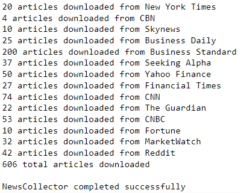

# :newspaper: Python NewsCollector

As the internet has grown, the available **sources of information at our disposal have equally grown**. Nowadays, if you want to update yourself with the most important news of the day, you have a **vast variety of news sources** to choose from. Since we have that many news sources at our disposal, instead of manually going through all their content...

**Couldn't we let **automation** pick the top news stories from various newspapers for us, and nicely combine them into a newsletter?**

**:fire: This is what the Python NewsCollector can do for us!**

> :bulb: For a **detailed usage guide**, please refer to the official [NewsCollector Usage Documentatíon](https://github.com/elisemercury/News-Collector/wiki/NewsCollector-Usage-Documentation).

> :closed_book: Read more about how the algorithm of NewsCollector works in [my Medium article](https://medium.com/@eliselandman/automated-news-article-collection-with-python-9267968c9ea).

-------

## Description

The Python NewsCollector lets you define a variety of news sources from which it will pick the **most relevant articles** and bundle these in a **nice HTML-based newsletter**. Below is an example of an auto-generated newsletter by NewsCollector on 23 January 2023:

<p align="center"> 
  
</p>

<p align="center">
View the full sample newsletter in PDF format <a href=https://github.com/elisemercury/NewsCollector/blob/main/sample_newsletter.pdf>here.</a>
</p>

The NewsCollector algorithm **scrapes** the source links provided and compares the articles it found based on their **similarity**. If it finds multiple articles from different sources covering similar topics, these will be considered as being **relevant articles** and will be included in the output newsletter.

<p align="center">
  
</p>

> :closed_book: Read more about how the algorithm of NewsCollector works in [my Medium article](https://medium.com/@eliselandman/automated-news-article-collection-with-python-9267968c9ea).

## Basic Usage

You can run the NewsCollector algorithm as follows:

```Python
from newscollector import *

newsletter = NewsCollector()
newsletter.create()
```

This will run the full NewsCollector pipeline by scraping the sources from the `sources.json` file and outputting the HTML newsletter.

> :bulb: For a **detailed usage guide**, please refer to the official [NewsCollector Usage Documentatíon](https://github.com/elisemercury/News-Collector/wiki/NewsCollector-Usage-Documentation).

## CLI Usage

The NewsCollector can also be run directly via the CLI with the following parameters:

```python
newscollector.py [-h] [-s SOURCES] [-n [NEWS_NAME]] [-d [NEWS_DATE]] 
                 [-t TEMPLATE] [-o OUTPUT_FILENAME]
```

## Output

The NewsCollector will output an **HTML newsletter** with the most **relevant articles** it found while scraping the sources provided. 

The output newsletter will be **saved as a file** in the working directory under the filename `newsletter_YYYY-MM-DD.html` where the date is the respective date the NewsCollector scraped its articles from. You can adjust the date as well as the output filename by setting the `news_date` and the `output_filename` parameters.

View a full sample newsletter in PDF format [here](https://github.com/elisemercury/NewsCollector/blob/main/sample_newsletter.pdf).

## Additional Parameters

You can customize the NewsCollector algorithm with the following optional parameters:

```Python
newsletter = NewsCollector(sources="sources.json", news_name="Daily News Update", news_date=date.today(), 
                           template='newsletter.html', output_filename='default')
```

> :bulb: For a **detailed usage guide**, please refer to the official [NewsCollector Usage Documentation](https://github.com/elisemercury/News-Collector/wiki/NewsCollector-Usage-Documentation).

-------

<p align="center"><b>
:heart: Open Source 
</b></p>
